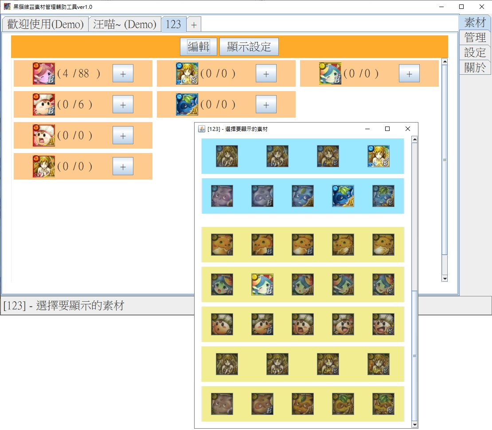
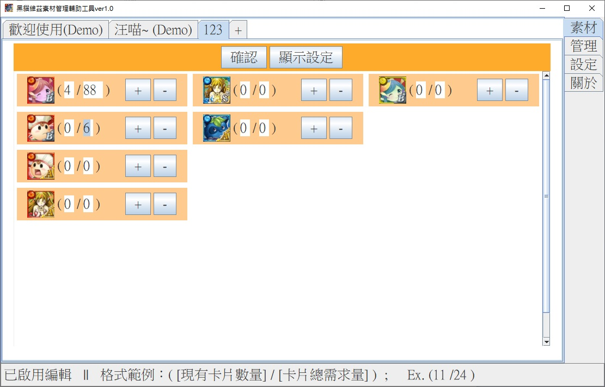
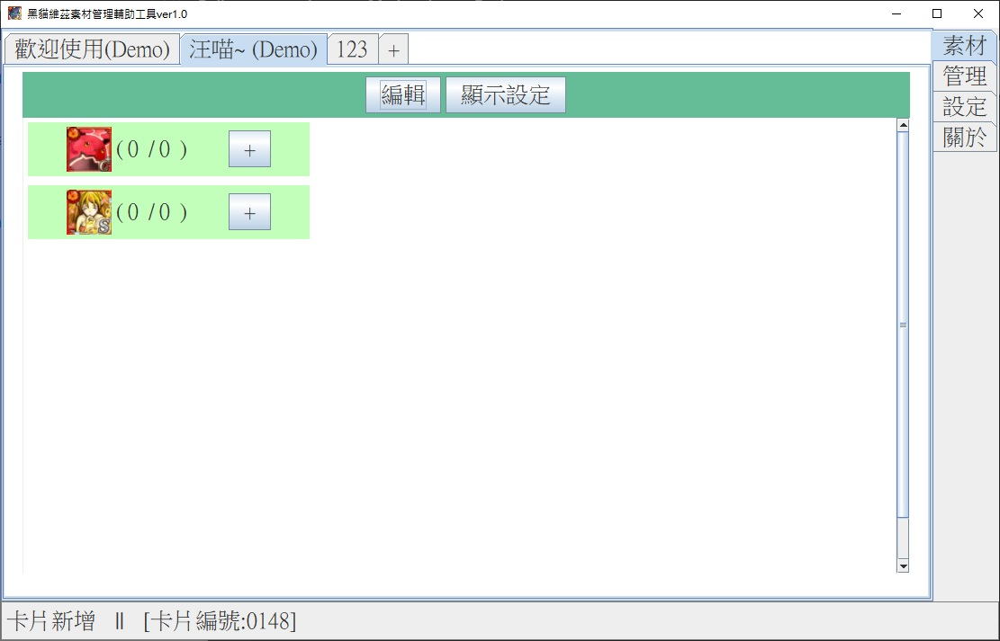
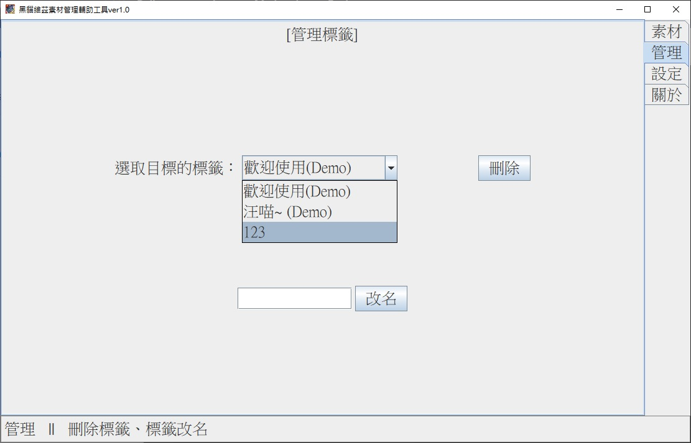
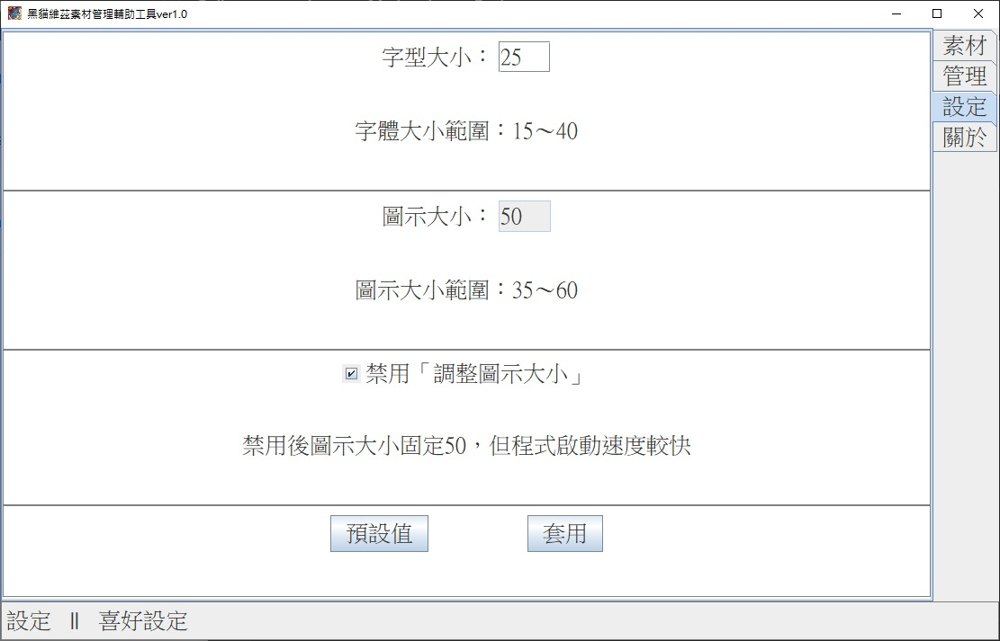
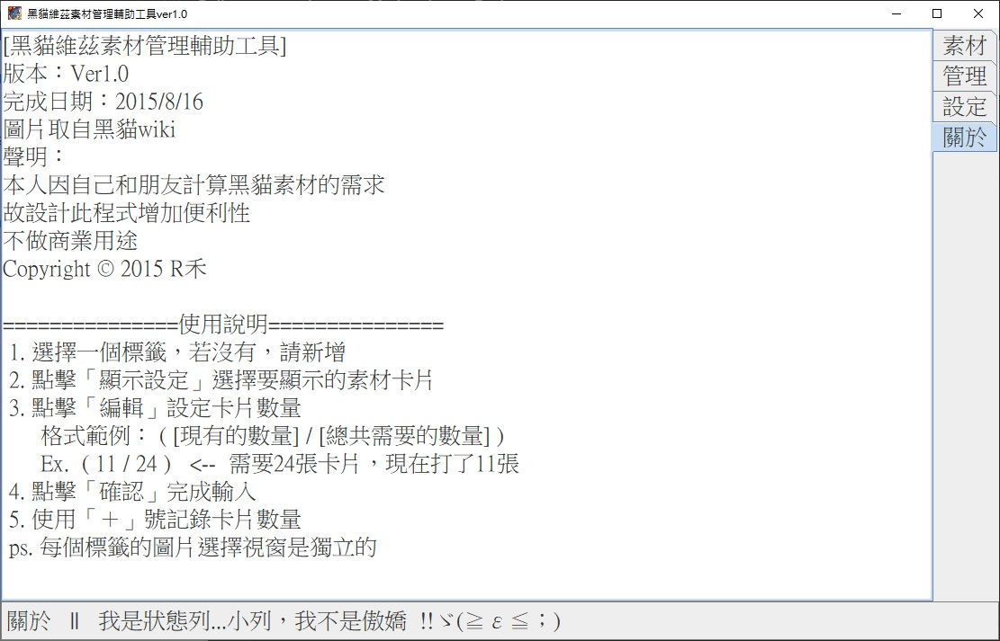

# BlackCatHelper
A materials calculator that was designed for the game "Black Cat" in the very early stage of it.
The game now got its own materials manager system.
Although it is useless now, it's the memory of my school days in 2014.

